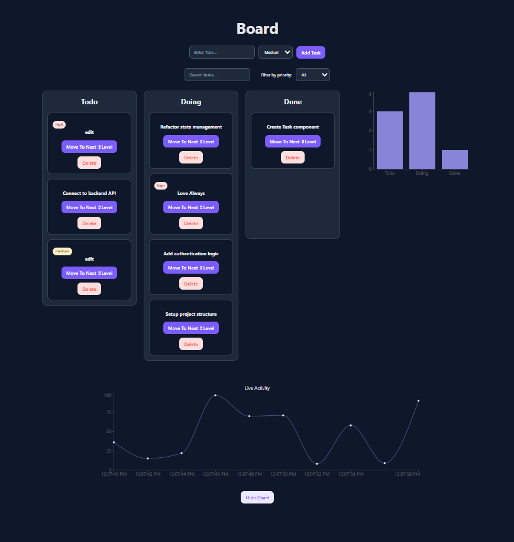

# Admin Dashboard

A responsive admin dashboard built with React, TypeScript, Vite, SCSS, Recharts, and @hello-pangea/dnd.

This project focuses on complex state management, drag-and-drop interactions, data visualization, reusable UI components, and persisted user preferences using localStorage.

## Main Goals

- Build a Trello-like task management board
- Practice drag-and-drop interaction with complex state updates
- Display dashboard data using charts
- Implement reusable UI components
- Add user personalization with persistent preferences
- Support dark and light mode

## Features

### Task Management

- Add new tasks
- Edit task title and priority
- Delete tasks
- Move tasks between columns
- Drag and drop tasks between columns
- Empty state for columns without visible tasks

### Filtering and Search

- Search tasks by title
- Filter tasks by priority
- Combine search and priority filtering

### Data Visualization

- Task chart based on board data
- Live activity chart
- Show / hide chart preference
- Chart visibility saved in localStorage

### Personalization

- Dark / light mode
- Theme saved in localStorage
- Chart layout preference saved in localStorage
- Task board data saved in localStorage

### UI / UX

- Responsive layout
- Reusable Button component
- Reusable Input component
- Reusable Select component
- Reusable Modal component
- Priority badges
- Hover edit action
- Mobile-friendly theme toggle

## Live Demo

https://admin-dashboard-dusky-rho-45.vercel.app

## Screenshot



## Tech Stack

- React
- TypeScript
- Vite
- SCSS
- Recharts
- @hello-pangea/dnd
- localStorage

## Getting Started

Install dependencies:

```bash
npm install